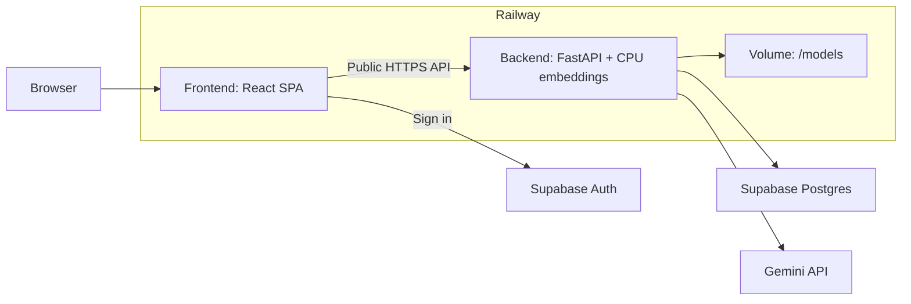

# Railway deployment checklist

**Docker is optional.** Use Railway's Railpack builder for both services. A custom
Dockerfile is useful later for exact runtime control or bundling the embedding
model into the image. [Railway builds](https://docs.railway.com/builds/build-configuration).

This is a setup guide; deployment has not been performed.

## Deployment layout



## 1. Prepare

- Push application changes and both lockfiles to GitHub.
- Keep secrets, `.env`, model caches, and downloaded filings out of Git.
- Use your existing populated Supabase project. No corpus reload is needed.
- For a new Supabase project, apply migrations and [load the corpus separately](backend/README.md#corpus-ingestion-and-retrieval).
- Use a Supabase **session pooler on port 5432** or a reachable direct connection.
  The app rejects the transaction pooler on port 6543. URL-encode special characters in the password.
- Review pending migrations: `0003_local_embeddings` clears old incompatible embeddings when first applied.

## 2. Create Railway services

Create one project with two services connected to the same GitHub repo.

| Setting | Backend | Frontend |
| --- | --- | --- |
| Name | `backend` | `frontend` |
| Root directory | `/backend` | `/frontend` |
| Builder | Railpack | Railpack |
| Watch paths | `/backend/**` | `/frontend/**` |

Commands run inside each root directory. [Monorepo setup](https://docs.railway.com/deployments/monorepo).

## 3. Backend: variables and commands

Add these under **backend → Variables**:

| Variable | Value |
| --- | --- |
| `SUPABASE_URL` | `https://<project-ref>.supabase.co` |
| `SUPABASE_ANON_KEY` | Public anon key |
| `SUPABASE_SERVICE_ROLE_KEY` | Secret service-role key |
| `DATABASE_URL` | Supabase session/direct connection URL |
| `GEMINI_API_KEY` | Gemini key |
| `GEMINI_MODEL` | `gemini-3.5-flash-lite`; verify availability for your key |
| `EMBEDDING_MODEL` | `BAAI/bge-small-en-v1.5` |
| `EMBEDDING_CACHE_DIR` | `/models/embeddings` |
| `ALLOWED_ORIGINS` | `http://localhost:5173` initially; replace in step 5 |
| `RAILPACK_PYTHON_VERSION` | `3.12` |
| `RAILWAY_HEALTHCHECK_TIMEOUT_SEC` | `600` initially; adjust after measuring startup |
| `COHERE_API_KEY` | Optional reranker key; otherwise omit |

1. Attach a **volume mounted at `/models`**.
2. Start with **one replica and one Uvicorn worker**. No GPU is needed.
3. Set **Build command**:

   ```sh
   uv sync --frozen --no-dev
   ```

4. Set **Pre-deploy command** (only this service should own migrations):

   ```sh
   uv run --no-sync alembic upgrade head
   ```

5. Set **Start command**, copying the whole line:

   ```sh
   sh -c 'uv run --no-sync python -m app.embeddings && exec uv run --no-sync uvicorn app.main:app --host 0.0.0.0 --port "$PORT"'
   ```

6. Set **Healthcheck Path** to `/health`.
7. Deploy → Networking → **Generate Domain**. Save the backend's HTTPS URL.
8. Check `https://<backend-domain>/health`; expect `{"status":"ok"}`.

**Why the startup command matters:**

- FastAPI requires a prepared model cache. `app.embeddings` prepares it before the API starts.
- The volume retains model files between deployments. Allow outbound model-download access.
- Download into the volume at startup: volumes are unavailable during build/pre-deploy.
- Use Railway's `PORT` and `0.0.0.0`; do not add `--reload`.
- `/health` checks startup, not live database retrieval or Gemini availability.

[Volumes](https://docs.railway.com/volumes), [pre-deploy migrations](https://docs.railway.com/deployments/pre-deploy-command),
[healthchecks](https://docs.railway.com/deployments/healthchecks).

## 4. Frontend: variables and commands

Add these under **frontend → Variables**, before building:

| Variable | Value |
| --- | --- |
| `VITE_API_BASE_URL` | `https://<backend-domain>` |
| `VITE_SUPABASE_URL` | Same Supabase project's URL |
| `VITE_SUPABASE_ANON_KEY` | Same project's public anon key |
| `RAILPACK_NODE_VERSION` | `24` |
| `RAILPACK_SPA_OUTPUT_DIR` | `dist` |

1. Set **Build command** to `pnpm build`. Railpack installs dependencies from the lockfile.
2. Keep build-time dev dependencies available: Vite and TypeScript need them.
3. Leave **Start command empty**. Railpack serves the Vite SPA with Caddy and route fallback.
4. Deploy → Networking → **Generate Domain**. Save the frontend's HTTPS URL.

- Use the backend's **public HTTPS URL**, not `railway.internal`.
- Do not use `pnpm dev` or `pnpm preview` for production.
- Never put Gemini, database, or service-role secrets in the frontend.
- Changing `VITE_*` values requires a **frontend rebuild**.

[Railpack Vite deployment](https://railpack.com/languages/node/), [Vite variables](https://vite.dev/guide/env-and-mode).

## 5. Connect and verify

1. Set backend `ALLOWED_ORIGINS` to the frontend HTTPS origin, **without a trailing slash**.
   For multiple origins, use commas. Redeploy the backend.
2. In Supabase Auth, set **Site URL** to the frontend URL and allow redirect URLs
   needed for email confirmation/recovery. [Auth URL settings](https://supabase.com/docs/guides/auth/redirect-urls).
3. Sign in → confirm threads load.
4. Ask: **“What drove Apple's Services sales growth in fiscal 2024?”**
5. Check streaming, citations, and the original SEC link.
6. Refresh a conversation URL directly → confirm the page and saved history load.
7. Ask an out-of-corpus question → confirm refusal.
8. Delete a temporary chat → refresh → confirm removal.

## Quick fixes

| Problem | Check |
| --- | --- |
| Backend will not start | Required variables, migration logs, model startup logs |
| Model cache missing | `/models` volume, cache variable, complete start command |
| Healthcheck timeout | `PORT`, host binding, first download time, memory |
| UI cannot reach API | Public API URL, frontend rebuild, exact CORS origin |
| Conversation refresh returns 404 | SPA mode; leave frontend start command empty |
| Supabase/auth failure | Same project on both services; keys and DB connection |
| Gemini quota/model error | Key quota and model availability; Docker will not fix this |
| No filing evidence | Corpus exists in the target Supabase database; retrieval results |

**Later releases:** push to the connected branch, review migrations, and rebuild
for changed frontend variables. Do not ingest the corpus on every startup.
Application rollback does not undo database migrations.
