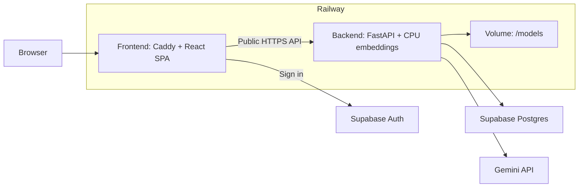

# Railway deployment checklist

**This project now uses Docker for deployment.** Railway detects each service's
Dockerfile automatically. Railway itself does not require Docker, but these
instructions use the Docker setup we chose. [Railway Docker builds](https://docs.railway.com/builds/dockerfiles).

- [Backend Dockerfile](backend/Dockerfile): Python 3.12, locked dependencies, model preparation, FastAPI.
- [Frontend Dockerfile](frontend/Dockerfile): Node builds React; Caddy serves the resulting static files.
- [Caddyfile](frontend/Caddyfile): port, health endpoint, and React route fallback.
- Both services have a `.dockerignore` to exclude local secrets and generated files.

This is a setup guide; deployment has not been performed.

## Deployment layout



## 1. Prepare

- Push application changes and both lockfiles to GitHub.
- Keep secrets, `.env`, model caches, and downloaded filings out of Git.
- Use your existing populated Supabase project. No corpus reload is needed.
- For a new Supabase project, apply migrations and [load the corpus separately](backend/README.md#corpus-ingestion-and-retrieval).
- Use a Supabase **session pooler on port 5432** or a reachable direct connection.
  The app rejects the transaction pooler on port 6543. URL-encode special characters in the password.
- Review pending migrations: `0003_local_embeddings` clears old incompatible embeddings when first applied.

## 2. Create Railway services

Create one project with two services connected to the same GitHub repo.

| Setting | Backend | Frontend |
| --- | --- | --- |
| Name | `backend` | `frontend` |
| Root directory | `/backend` | `/frontend` |
| Dockerfile | `backend/Dockerfile` | `frontend/Dockerfile` |
| Watch paths | `/backend/**` | `/frontend/**` |

Commands run inside each root directory. [Monorepo setup](https://docs.railway.com/deployments/monorepo).
Confirm build logs show **Using detected Dockerfile**. Clear previous custom
build/start commands so Railway uses the Dockerfiles.

## 3. Backend: variables and commands

Add these under **backend → Variables**:

| Variable | Value |
| --- | --- |
| `SUPABASE_URL` | `https://<project-ref>.supabase.co` |
| `SUPABASE_ANON_KEY` | Public anon key |
| `SUPABASE_SERVICE_ROLE_KEY` | Secret service-role key |
| `DATABASE_URL` | Supabase session/direct connection URL |
| `GEMINI_API_KEY` | Gemini key |
| `GEMINI_MODEL` | `gemini-3.5-flash-lite`; verify availability for your key |
| `EMBEDDING_MODEL` | `BAAI/bge-small-en-v1.5` |
| `EMBEDDING_CACHE_DIR` | `/models/embeddings` |
| `ALLOWED_ORIGINS` | `http://localhost:5173` initially; replace in step 5 |
| `RAILWAY_HEALTHCHECK_TIMEOUT_SEC` | `600` initially; adjust after measuring startup |
| `COHERE_API_KEY` | Optional reranker key; otherwise omit |

1. Attach a **volume mounted at `/models`**.
2. Start with **one replica and one Uvicorn worker**. No GPU is needed.
3. Leave **Build command** and **Start command empty**. The Dockerfile installs
   dependencies and its `CMD` starts the application.
4. Set **Pre-deploy command** (only this service should own migrations):

   ```sh
   alembic upgrade head
   ```

5. Set **Healthcheck Path** to `/health`.
6. Deploy → Networking → **Generate Domain**. Save the backend's HTTPS URL.
7. Check `https://<backend-domain>/health`; expect `{"status":"ok"}`.

**Why the startup command matters:**

- FastAPI requires a prepared model cache. `app.embeddings` prepares it before the API starts.
- The volume retains model files between deployments. Allow outbound model-download access.
- Download into the volume at startup: volumes are unavailable during build/pre-deploy.
- Use Railway's `PORT` and `0.0.0.0`; do not add `--reload`.
- `/health` checks startup, not live database retrieval or Gemini availability.

[Volumes](https://docs.railway.com/volumes), [pre-deploy migrations](https://docs.railway.com/deployments/pre-deploy-command),
[healthchecks](https://docs.railway.com/deployments/healthchecks).

## 4. Frontend: variables and commands

Add these under **frontend → Variables**, before building:

| Variable | Value |
| --- | --- |
| `VITE_API_BASE_URL` | `https://<backend-domain>` |
| `VITE_SUPABASE_URL` | Same Supabase project's URL |
| `VITE_SUPABASE_ANON_KEY` | Same project's public anon key |

1. Leave **Build command** and **Start command empty**. The Dockerfile builds
   with `pnpm build` and starts Caddy.
2. Set **Healthcheck Path** to `/health`.
3. The three `VITE_*` variables above are declared as Docker build arguments;
   Railway supplies their values during the build.
4. Deploy → Networking → **Generate Domain**. Save the frontend's HTTPS URL.

- Use the backend's **public HTTPS URL**, not `railway.internal`.
- Do not use `pnpm dev` or `pnpm preview` for production.
- Never put Gemini, database, or service-role secrets in the frontend.
- Changing `VITE_*` values requires a **frontend rebuild**.

[Docker build variables](https://docs.railway.com/builds/dockerfiles#using-variables-at-build-time),
[Vite variables](https://vite.dev/guide/env-and-mode).

## 5. Connect and verify

1. Set backend `ALLOWED_ORIGINS` to the frontend HTTPS origin, **without a trailing slash**.
   For multiple origins, use commas. Redeploy the backend.
2. In Supabase Auth, set **Site URL** to the frontend URL and allow redirect URLs
   needed for email confirmation/recovery. [Auth URL settings](https://supabase.com/docs/guides/auth/redirect-urls).
3. Sign in → confirm threads load.
4. Ask: **“What drove Apple's Services sales growth in fiscal 2024?”**
5. Check streaming, citations, and the original SEC link.
6. Refresh a conversation URL directly → confirm the page and saved history load.
7. Ask an out-of-corpus question → confirm refusal.
8. Delete a temporary chat → refresh → confirm removal.

## Quick fixes

| Problem | Check |
| --- | --- |
| Backend will not start | Required variables, migration logs, model startup logs |
| Startup downloads PyTorch/CUDA/dev tools | Clear Railway's custom Start Command and use the Docker CMD; plain `uv run` syncs dev dependencies. The Docker image sets `UV_NO_SYNC=1` after installing runtime dependencies. |
| Model cache missing | `/models` volume, cache variable, Docker startup logs |
| Healthcheck timeout | `PORT`, host binding, first download time, memory |
| UI cannot reach API | Public API URL, frontend rebuild, exact CORS origin |
| Conversation refresh returns 404 | Caddyfile route fallback; leave frontend start command empty |
| Supabase/auth failure | Same project on both services; keys and DB connection |
| Gemini quota/model error | Key quota and model availability; Docker will not fix this |
| No filing evidence | Corpus exists in the target Supabase database; retrieval results |

If the traceback stops at `from app.config import settings`, copy its final
exception lines. Check required backend Variables and the database URL; local
`.env` files are deliberately excluded from the image. Downloads alone do not
identify the cause of a configuration crash.

**Later releases:** push to the connected branch, review migrations, and rebuild
for changed frontend variables. Do not ingest the corpus on every startup.
Application rollback does not undo database migrations.

## Optional: run the same images locally

From the repository root, with Docker running:

```sh
docker build -t copilot-backend ./backend
docker run --rm -p 8000:8000 --env-file backend/.env \
  -e EMBEDDING_CACHE_DIR=/models/embeddings -v copilot-models:/models copilot-backend
```

Build the frontend with public configuration (replace placeholders):

```sh
docker build -t copilot-frontend \
  --build-arg VITE_API_BASE_URL=http://localhost:8000 \
  --build-arg VITE_SUPABASE_URL='https://<project-ref>.supabase.co' \
  --build-arg VITE_SUPABASE_ANON_KEY='<public-anon-key>' ./frontend
docker run --rm -p 5173:8080 copilot-frontend
```

Open `http://localhost:5173`; backend CORS must allow that origin.
Docker image build/run verification is pending: this environment's Docker daemon
denies access. No Railway deployment has been performed.
