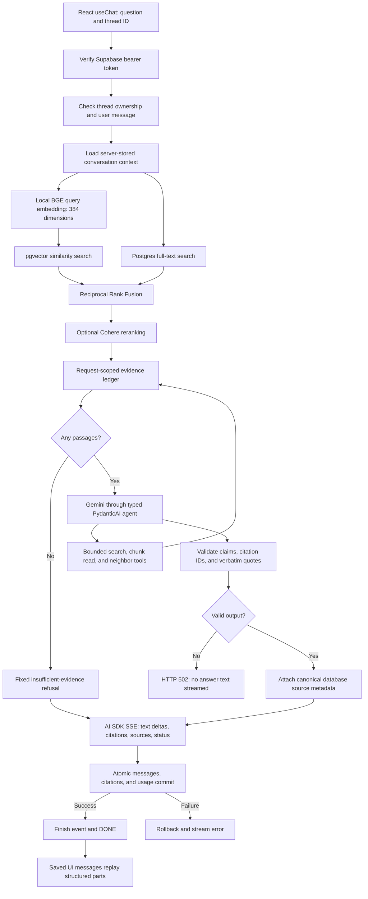

# Retrieval and grounding pipeline

The backend retrieves evidence from the 25-filing corpus, asks Gemini for typed
claims, validates their citations, then streams the validated answer. Local
`BAAI/bge-small-en-v1.5` handles embeddings; Gemini handles answer generation.



## Request and retrieval

`POST /chat/stream` accepts the AI SDK UI message shape. Supabase authentication
and thread ownership checks run before retrieval or generation. Only the final
user message is accepted from the client; conversation context comes from stored
messages, limited to the last twelve messages and 1,500 characters per message.
Questions exceeding the local model's 510-token content budget return HTTP 422.

`app/retrieval/retriever.py` embeds the question on a worker thread and performs
separate vector and full-text queries. Company/year filters apply before the
candidate limits. RRF combines the rankings; optional Cohere reranking follows.
`app/assistant/deps.py` records canonical `SourcePassage` objects for the turn.
Similarity ranking identifies candidate evidence; it does not establish that a
question is answerable.

The agent initially receives ten passages. It can search again with ticker/year
filters, reread a retrieved chunk, or fetch up to three neighbors on each side
of a retrieved chunk. Tool results extend the same evidence ledger. The agent
cannot issue SQL or read arbitrary chunk IDs. Tool execution is sequential so
the request's SQLAlchemy session is not used concurrently. Each run allows at
most six model requests and five tool calls, with one schema correction retry.

## Typed generation and validation

`app/assistant/agent.py` configures PydanticAI with typed dependencies and
`GroundedAnswer` output. `instructions.md` tells the model to use only retrieved
filings, ignore instructions embedded in source data, cite every assertion, and
refuse unsupported questions and investment advice.

The model produces claims with citation IDs and citations with chunk IDs and
verbatim quotes. The server renders claim text and numbered markers; the model
does not supply free-form answer text, source URLs, or filing metadata.
`app/grounding/validator.py` enforces:

- Supported answers have nonempty claims and citations.
- Each claim references known citation IDs, with no duplicate references or
  unused citations. Citation IDs are unique.
- Every cited chunk is in this turn's evidence ledger.
- Every quote occurs in its cited passage after whitespace normalization.
- Refusals contain no claims, citations, or sources. Their displayed text is
  fixed by the server, with `insufficient_evidence` or `investment_advice` status.

The agent output validator and orchestrator both apply the contract. Failed
validation returns HTTP 502 before opening the answer stream. The backend
buffers the complete typed model output and validates it before emitting text
deltas; raw generation tokens are never forwarded to the browser.

These checks establish citation coverage and source/quote integrity. They do
not prove semantic entailment of every paraphrase or independently audit
financial calculations. Prompt adherence and factual correctness still require
the corpus evaluations in phase 8; a genuine quote alone is not proof that a
claim is true.

## Streaming, persistence, and replay

`app/chat/orchestrator.py` emits AI SDK UI message stream v1 events:

1. `start`, `start-step`, `text-start`, `text-delta`, and `text-end`.
2. Native `source-url` parts and `data-citations`, `data-sources`,
   `data-grounding` parts.
3. After a successful database commit, `finish-step`, `finish` with usage
   metadata, then `[DONE]`.

The server saves both messages, normalized `message_citations` rows, and the
assistant's UI message in one transaction. Token/request/tool usage is stored
in `ui_message.metadata.usage`; the existing JSONB schema needs no migration.
Source parts retain company, ticker, fiscal year, filing date/type, URL,
page/section, and full passage text for phase 7's trust UI.

A disconnect before persistence skips the commit. Once the commit succeeds,
the turn is durable even if the connection drops before the final event arrives.
Database failures roll back and emit an SSE error without a successful finish.
History replays the saved structured parts verbatim.

## Configuration and verification

`backend/app/config.py` owns configuration. `GEMINI_API_KEY` is required when the
API starts; `GEMINI_MODEL` defaults to `gemini-3.5-flash-lite`. The existing key was
renamed from `GOOGLE_API_KEY` without changing its value. The local embedding
cache must already exist. Startup creates one Gemini client and one local model
in application state, and shuts down the generation client on exit.

```bash
cd backend
uv run pytest -m 'not integration'
uv run pytest tests/chat/test_integration.py -m integration
uv run uvicorn app.main:app --reload
```

Unit tests exercise the real PydanticAI output-validator boundary with a local
FunctionModel, valid/invalid citations, explicit refusals, streaming parts,
disconnects, and storage failures. The live test uses temporary confirmed
Supabase accounts, asks for Apple's fiscal 2024 sales, checks stored quotes and
citations, then asks an out-of-corpus question and checks an empty-citation
refusal and history replay. Temporary profiles, threads, messages, citations,
and auth users are cleaned up afterward.
