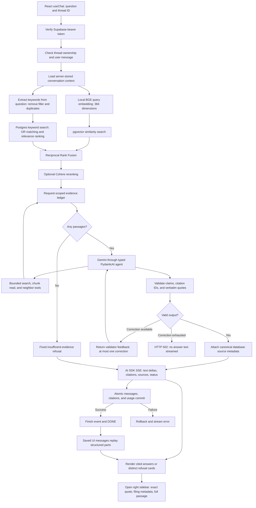

# Retrieval and grounding pipeline

The backend retrieves evidence from the 25-filing corpus, asks Gemini for typed
claims, validates their citations, then streams the validated answer. Local
`BAAI/bge-small-en-v1.5` handles embeddings; Gemini handles answer generation.



## Request and retrieval

`POST /chat/stream` accepts the AI SDK UI message shape. Supabase authentication
and thread ownership checks run before retrieval or generation. Only the final
user message is accepted from the client; conversation context comes from stored
messages, limited to the last twelve messages and 1,500 characters per message.
Questions exceeding the local model's 510-token content budget return HTTP 422.

`app/retrieval/retriever.py` embeds the question on a worker thread and performs
separate vector and keyword full-text queries. Company/year filters apply before the
candidate limits. RRF combines the rankings; optional Cohere reranking follows.
`app/assistant/deps.py` records canonical `SourcePassage` objects for the turn.
Similarity ranking identifies candidate evidence; it does not establish that a
question is answerable.

### Keywords for full-text search

The semantic branch embeds the complete question to retain its context. The
lexical branch calls `extract_keywords` in `app/retrieval/keywords.py` before
searching `document_chunks.search_vector`:

1. Lowercase the question and normalize possessives (`Apple's` / `Apple’s` →
   `apple`).
2. Extract alphanumeric tokens, keeping company names, tickers, financial terms,
   and numbers such as fiscal years.
3. Remove common stop words and conversational filler such as `what`, `please`,
   `show`, `compare`, and `vs`.
4. Deduplicate keywords in their original order.
5. Bind an OR expression to `to_tsquery('english', :keyword_query)`. PostgreSQL
   applies English stemming and its own stop-word dictionary. Rank matches with
   `ts_rank_cd`, then use chunk ID to break ties consistently.

Example:

```text
Question: What is Apple's iPhone vs Services revenue mix?
Keywords: apple, iphone, services, revenue, mix
FTS input: apple | iphone | services | revenue | mix
```

A passage can match any extracted keyword, so it need not contain every word
from a conversational question. OR matching broadens candidates; full-text
ranking and fusion with semantic search determine the final passage order.
Ticker/year filters still apply before candidate limits. If extraction produces
no keywords, the lexical branch returns no candidates and semantic retrieval
continues. SQL remains parameterized, and user punctuation is discarded before
building the expression; quoted phrases and exclusion operators are not search
syntax in this keyword mode.

Extraction is a local, deterministic heuristic. It uses no LLM call or added
dependency, and does not infer synonyms or resolve ambiguous company names.
The semantic branch supplies context-based matching. Initial retrieval and the
agent's `search_filings` tool both use this same keyword extraction path.

The agent initially receives ten passages. It can search again with ticker/year
filters, reread a retrieved chunk, or fetch up to three neighbors on each side
of a retrieved chunk. Tool results extend the same evidence ledger. The agent
cannot issue SQL or read arbitrary chunk IDs. Tool execution is sequential so
the request's SQLAlchemy session is not used concurrently. Each run allows at
most six model requests and five tool calls, with one schema or grounding
correction retry. Grounding failures return validator feedback through
PydanticAI's `ModelRetry`; a corrected answer must pass the same checks. If the
correction budget is exhausted, the turn fails before any answer text streams.
Retrieval tools are removed after four model requests or five tool calls, so
the remaining requests can produce the final answer and its correction. If the
collected evidence is insufficient at that point, the model must refuse.

## Typed generation and validation

`app/assistant/agent.py` configures PydanticAI with typed dependencies and
`GroundedAnswer` output. `instructions.md` tells the model to use only retrieved
filings, ignore instructions embedded in source data, cite every assertion, and
refuse unsupported questions and investment advice.

The model produces claims with citation IDs and citations with chunk IDs and
verbatim quotes. The server renders claim text and numbered markers; the model
does not supply free-form answer text, source URLs, or filing metadata.
`app/grounding/validator.py` enforces:

- Supported answers have nonempty claims and citations.
- Each claim references known citation IDs, with no duplicate references or
  unused citations. Citation IDs are unique.
- Every cited chunk is in this turn's evidence ledger.
- Every quote occurs in its cited passage after whitespace normalization.
- Refusals contain no claims, citations, or sources. Their displayed text is
  fixed by the server, with `insufficient_evidence` or `investment_advice` status.

The agent output validator and orchestrator both apply the contract. Failed
validation returns HTTP 502 before opening the answer stream. The backend
buffers the complete typed model output and validates it before emitting text
deltas; raw generation tokens are never forwarded to the browser.

These checks establish citation coverage and source/quote integrity. They do
not prove semantic entailment of every paraphrase or independently audit
financial calculations. Prompt adherence and factual correctness still require
the corpus evaluations in phase 8; a genuine quote alone is not proof that a
claim is true.

## Streaming, persistence, and replay

`app/chat/orchestrator.py` emits AI SDK UI message stream v1 events:

1. `start`, `start-step`, `text-start`, `text-delta`, and `text-end`.
2. Native `source-url` parts and `data-citations`, `data-sources`,
   `data-grounding` parts.
3. After a successful database commit, `finish-step`, `finish` with usage
   metadata, then `[DONE]`.

The server saves both messages, normalized `message_citations` rows, and the
assistant's UI message in one transaction. Token/request/tool usage is stored
in `ui_message.metadata.usage`; the existing JSONB schema needs no migration.
Source parts retain company, ticker, fiscal year, filing date/type, URL,
page/section, and full passage text for phase 7's trust UI.

A disconnect before persistence skips the commit. Once the commit succeeds,
the turn is durable even if the connection drops before the final event arrives.
Database failures roll back and emit an SSE error without a successful finish.
History replays the saved structured parts verbatim.

## Inspecting evidence in the chat UI

Answers, citation excerpts, and retrieved passages render Markdown tables with
column borders and horizontal scrolling. Complete Docling row/column triplet
lines are converted to tables for display only, preserving column positions,
empty cells, and repeated values. Generic column numbers are used when the
serialization does not provide headers. Incomplete or unrecognized lines remain
verbatim. Stored quotes and the grounding validator still use the original text.
Answer-table citation markers appear below the table so they remain clickable.

The renderer uses `react-markdown` and `remark-gfm` on every assistant message
and evidence view. Markdown parsing with nested inline formatting, escaped table
cells, and safe URL handling cannot be implemented correctly in thirty lines.
These maintained unified ecosystem parsers add 96 packages to the lockfile;
they are a deliberate parser dependency rather than a utility wrapper. Raw HTML
is not enabled. The small Docling triplet conversion stays in local code.

The frontend reads the same typed citation, source, and grounding parts from
live responses and saved history. Clicking a numbered citation opens its exact
quote in a right-hand evidence sidebar, together with company/ticker, filing type,
fiscal year, filing date, and page/section. Missing HTML locations are labeled
unavailable. The full retrieved passage can be expanded with the quote
highlighted; the original SEC filing remains available through a separate link.
“Open original SEC filing” opens a new tab with a URL text fragment built from
the cited quote (whitespace normalized, conversion-added spaces before trademark
symbols removed, and fragment punctuation encoded). In
supporting browsers, a matching excerpt is scrolled into view and highlighted.
This is a best-effort match against the SEC page, not a verified HTML location:
flattened tables, changed punctuation, and quotes spanning HTML blocks may not
match. If unsupported or unmatched, the filing opens normally. “Open without
highlighting” provides a plain filing link. Neither link changes the SEC document
or the stored evidence. See [browser text-fragment behavior](https://developer.mozilla.org/en-US/docs/Web/URI/Reference/Fragment/Text_fragments).
The panel sits beside the conversation on wide screens and opens as a drawer
on smaller screens. Switching conversations closes the previous evidence panel.

Insufficient-evidence and investment-advice refusals have distinct amber cards
and explicit labels. Older messages without grounding parts are not labeled as
cited answers. The shared authenticated fetch adapter preserves HTTP status
errors for the chat stream and JSON routes, so the UI distinguishes session,
ownership, missing-thread, invalid-input, generation, server, and network/CORS
failures. Successful turns give untitled threads a question-derived title and
update the sidebar timestamp.

Conversation deletion uses authenticated `DELETE /threads/{id}`. The backend
checks ownership before deletion (403 for another user's thread, 404 for a
missing thread). Existing database foreign-key cascades remove its messages
and message citations atomically. The UI asks for confirmation and stops an
active chat stream when leaving the deleted conversation.

## Configuration and verification

`backend/app/config.py` owns configuration. `GEMINI_API_KEY` is required when the
API starts; `GEMINI_MODEL` defaults to `gemini-3.5-flash-lite`. The existing key was
renamed from `GOOGLE_API_KEY` without changing its value. The local embedding
cache must already exist. Startup creates one Gemini client and one local model
in application state, and shuts down the generation client on exit.

```bash
cd backend
uv run pytest -m 'not integration'
uv run pytest tests/chat/test_integration.py -m integration
uv run uvicorn app.main:app --reload
```

Unit tests exercise the real PydanticAI output-validator boundary with a local
FunctionModel, valid/invalid citations, explicit refusals, streaming parts,
disconnects, and storage failures. The live test uses temporary confirmed
Supabase accounts, asks for Apple's fiscal 2024 sales, checks stored quotes and
citations, then asks an out-of-corpus question and checks an empty-citation
refusal and history replay. Temporary profiles, threads, messages, citations,
and auth users are cleaned up afterward.
